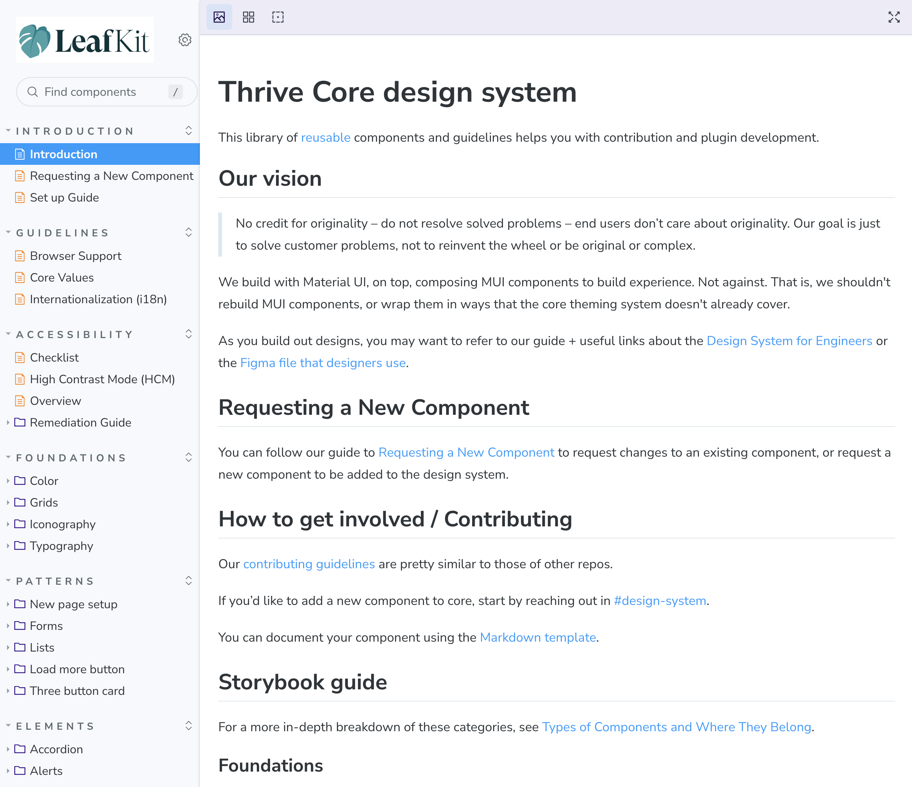
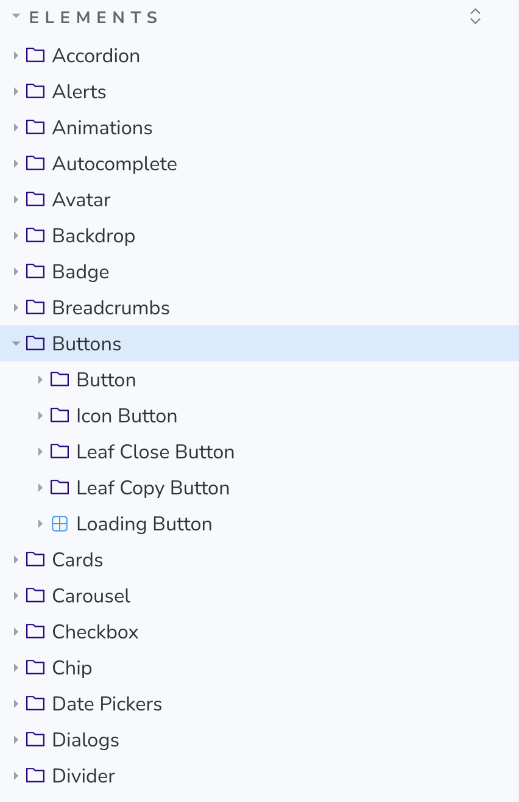
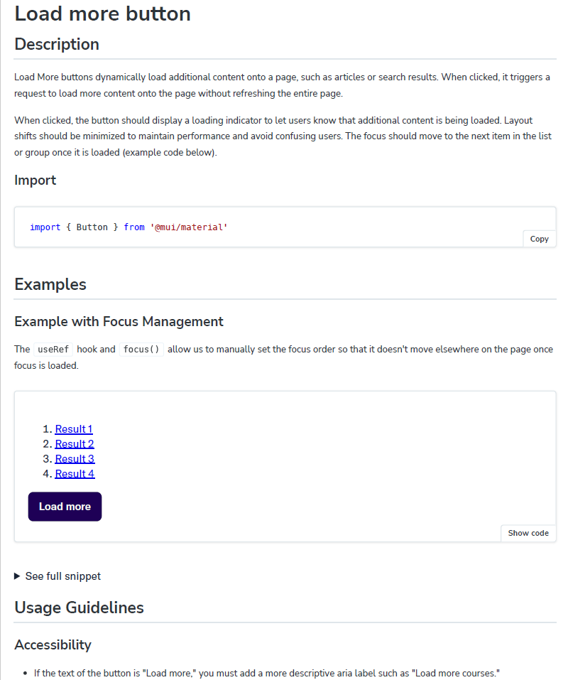

When I joined, I inherited a faltering set of components with little guardrails. By the end of my tenure, I’d matured the design system's components and documentation into a steady state that met our high standards of accessibility, internationalization, and scalability. Focusing on the golden path and “making the right choice easy” helped us address friction in adoption and supported our design system’s maturation over three years.

## Impact
We immediately saw an increase in cohesion and decrease in rogue components, as well as a faster pace of iteration in early design work. Designers and developers gave more feedback, leading to higher visual consistency. Through reusable components, I virtually eliminated accessibility and internationalization issues in the design system and found that the majority of front-end code adhered to best practices. 

I prioritized developer velocity and shifted people to use out-of-the-box componentry when possible. This golden path approach meant that the design systems team would proactively identify issues to develop into components. A tokened design system meant we could bake in our accessibility standards or push changes to color and typography easily. A single change in Leafkit could fix an accessibility issue in every single one of its implementations.

Simply by upgrading to the latest version of Leafkit, developers received fixes under the hood for issues such as
- High contrast mode and color contrast
- Appropriately-sized mobile touch targets
- Best practices for aria labeling and semantic HTML.

## The stack
- **React Typescript**: many components are presentational or black boxed - we wanted to limit visual customization in while allowing for custom logic. 
- **Storybook**: developer single source of truth.
- **Lighthouse, react-axe and eslint-plugin-jsx-a11y**: automated accessibility testing.
- **Figma**: maintained by the design team to provide additional context.
- **Sourcegraph monitoring**: custom alerting on Github PRs for code with anti-patterns and outdated component usage. Decreased pings imply that education and thoughtful componentry reduce anti-patterns.

## Launch
I inherited a clunky Figma file that we quickly converted to Storybook for better visualization of states and props. For the “re-launch,” I explored other company’s Storybooks to find valuable plug ins and information architecture. I “right-sized” this by avoiding adding code or features that would quickly become stale or require significant maintenance.

## Measuring value and metrics
Showing data for design systems ROI is an industry-wide challenge which is often done through surveys and proxy metrics that require additional resourcing. Our metrics tracked:
- Reduced time to refactor and anecdotal "wins" in reduced migration time
- Sourcegraph monitoring showed increased usage of Leaf components over MUI where relevant
- Monitoring alerts of anti-patterns decreased to almost 0
- Lighthouse accessibility scores of 90+ across all repos

## Maturation and maintenance
Documenting a design system isn’t enough - its success depends on its usage, context, and people. I focused on strategic maturation and explaining why it matters by tying it to our mission of developer velocity and visual consistency. After starting by documenting our MUI components, with the shared ownership of the design team, I began adding our custom “Leaf” components once I assessed their technological feasibility and maintainability. I added new components to codify new patterns, such as a card suite, and to take the guesswork out of trickier accessibility implementations, such as tooltips or copy to clipboard buttons. 

After documenting our “atoms,” the team matured into adding “molecules” and more complex flows. Regular feedback from partners across the organization has led me to bake in more internationalization and content guidelines. I’ve added code snippets as antidotes for common anti-patterns and questions around semantic HTML. New components are demoed at office hours so that we can receive additional feedback.

## 3 years later
Developers report little issue in getting started and new designs “just work.” Developers will also ask designers to confirm their designs use existing components. Redesigns can be done in a week and accessibility issues within the design systems are virtually non-existent. Recently, I shipped a visual update in under a week that updated typography, buttons, and other styling - the migration process involved a batch change to update other repos to the latest version of Leafkit. Et voila!