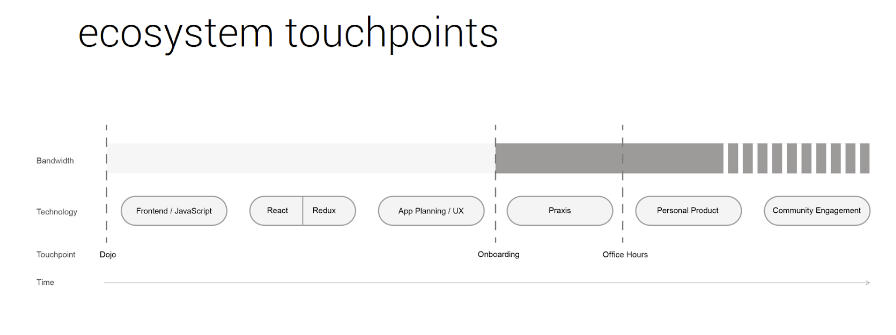
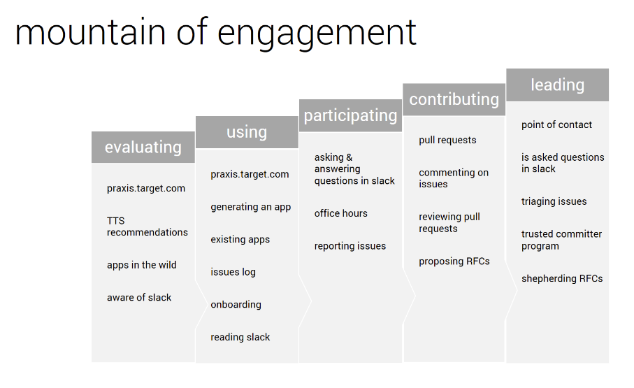

Praxis is a JavaScript starter app for building user interfaces. It is Target’s recommended tool for quickly designing, developing, and deploying the front end of internal products. Praxis is built and maintained at Target by a core team and a community of contributors.  Over 100 teams used Praxis - a 15 minute update on our end meant hours of developer time saved across hundreds of production apps.

I worked closely with our enterprise design systems designer to prototype new features and components and to give technical feedback. I wrote documentation, shared best practices, and maintained dependencies.

In an organization transitioning from Angular to React, it was crucial that we provided significant documentation. I also answered questions at office hours and provided guidance on contribution to this innersource ecosystem. Using a service design framework, I helped us focus our offerings for maximum impact and to prioritize community engagement for sustainability. As the organizational knowledge of React increased, we narrowed our scope and relied on partners within the community to provide other essential training to allow us to focus more on our core value exchanges.

## The stack
- **React Typescript** and **emotion** on top of **WebGL** for the interface
- **Redux** and **React Context** for state management
- **React Testing Library** and **Browserstack** for testing across browsers and devices
- **Nicollet**, Target’s design system, for visual consistency

