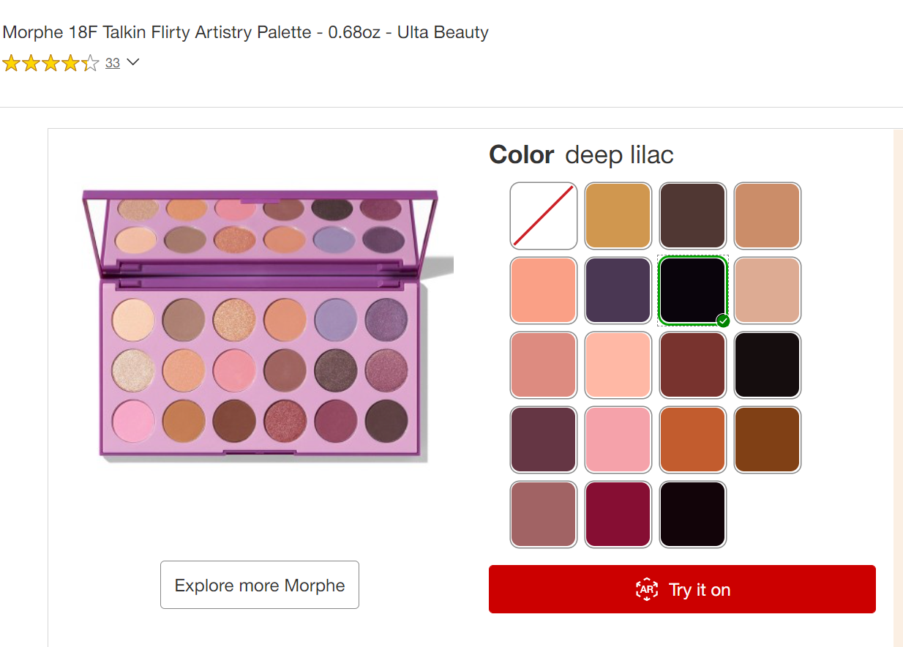

As a UI engineer, I created interfaces in React Typescript for Target’s experimental experiences like [Virtual Try-on](https://www.target.com/c/virtual-makeup-try-on/-/N-3726b) and [Room Planner](https://www.target.com/planners/home-planner).

I shadowed user studies and monitored our feedback form to address bugs and surface easy engineering wins. We were often the first to consume new APIs and design system components so QA and working with other teams was a key part of the role. At times, this involved reviewing models and inputting test data for our beauty collection.

For our long-awaited Ulta Beauty collaboration, I developed a swatch component built on componentry and standards available in our design system. In conjunction with the accessibility team, I delivered a component that met our accessibility guidelines and could perform at scale. I was able to contribute this component (alongside other fixes) to our design system for the rest of the company to use.

## The stack
- **React Typescript** and **emotion** on top of **WebGL** for the interface
- **Redux** and **React Context** for state management
- **React Testing Library** and **Browserstack** for testing across browsers and devices
- **Nicollet**, Target’s design system, for visual consistency

I worked closely with our designer to rapidly prototype new flows and pages and advocated for component re-use from our design system. When we began to expand our jurisdiction into other room planners and interfaces, I started a separate internal component library to speed up our development process.

