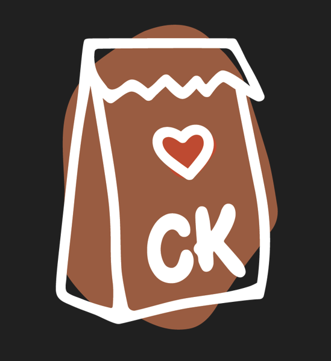
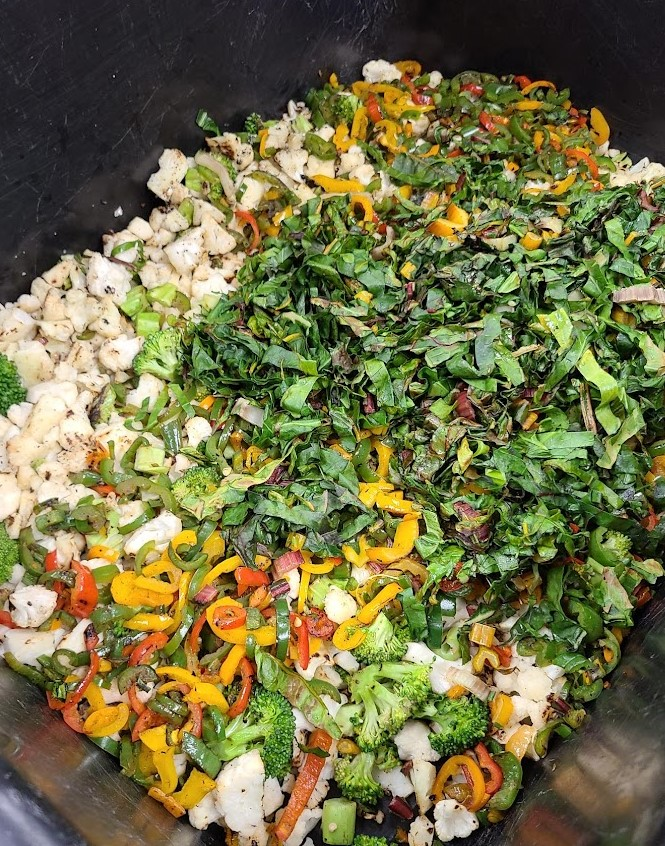
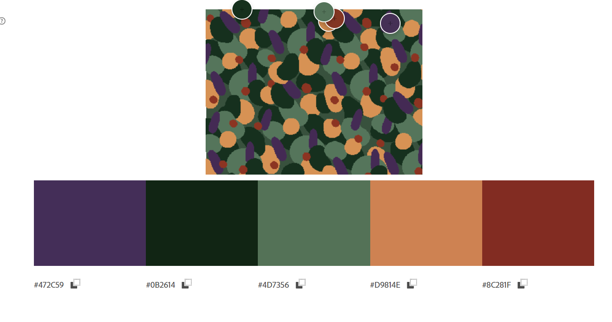
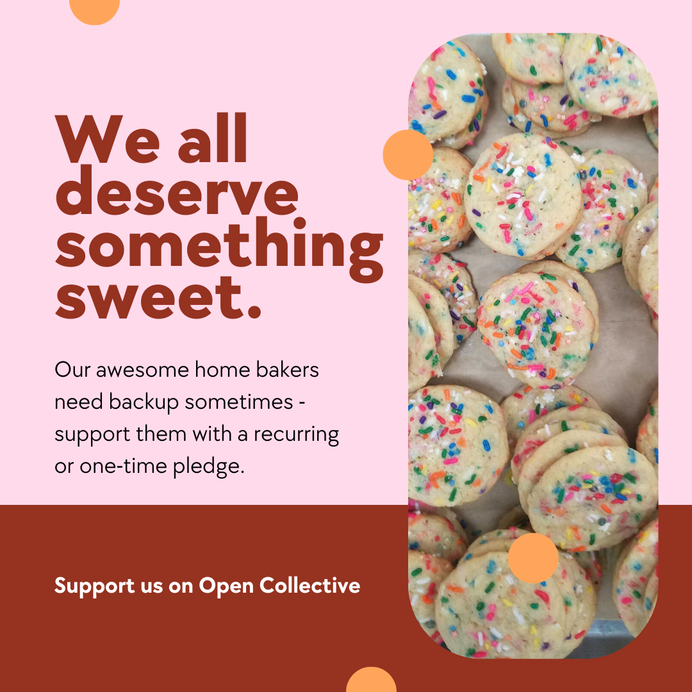
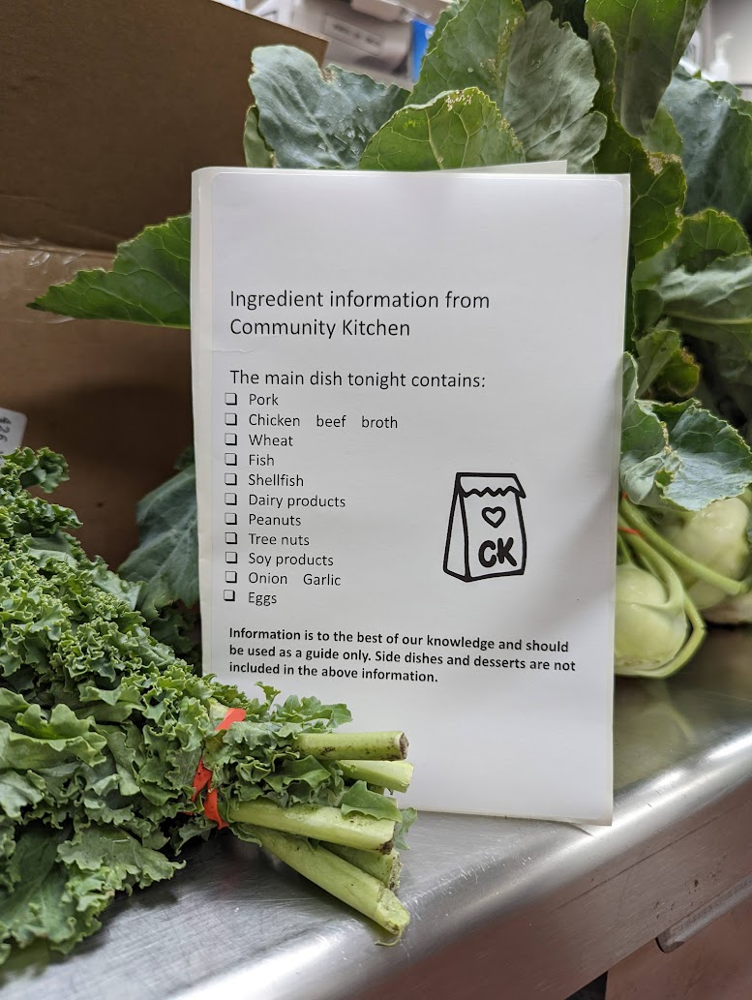
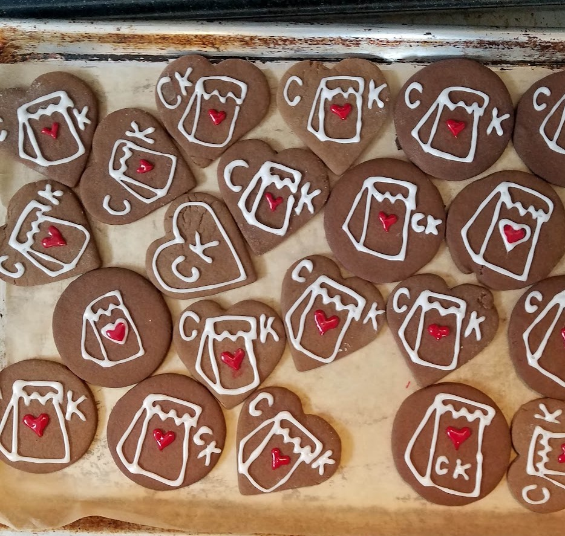

Community Kitchen Minneapolis is a volunteer team that turns food rescue into dinners for people living in encampments. As an organization focused on doing the work, after a few years in, they wanted a logo!

As a member of the kitchen team, I wanted something that people felt connected to and not something over-designed. I asked for input and drew inspiration from the colors of the food we used to develop a loose color palette for our branding. It was important to create something that anyone could use without my involvement, so I provided a variety of color styles and file types.

## Social media strategy 
After creating the logo, I focused on taking social media off an overburdened member’s plate. During kitchen shifts, I would recruit new volunteers to rotate onto the social media team and encourage all members to send in photos. Many of our members worked from mobile phones and had little design background, so approximate colors were excellent for fostering cohesion without seeming limiting. I created templates in Canva that people could use if they didn’t want to start from scratch.

Our main calls to action were for monetary support and volunteers. In six months, CK MPLS was a fully funded organization with a consistent volunteer roster. The majority of new volunteers found their way through our Instagram presence.

I created reels and posts that explained the kitchen behind-the-scenes and why we needed funding. For days when volunteers flaked, I developed a social share plan for emergency posts to maximize effectiveness. 

## Impact

People loved the new logo and most importantly, were able to seamlessly integrate it into their work! One volunteer created an ingredient list sticker with the logo to help identify our deliveries. With templates and a rotating schedule reducing the effort to post, donors and potential  volunteers could see the impact of their work on a regular basis. I increased our following 10x to just under 3000 followers, which allowed us to support other local organizations with our reach. A local thrift store even offered a discount if you volunteered with us. 

