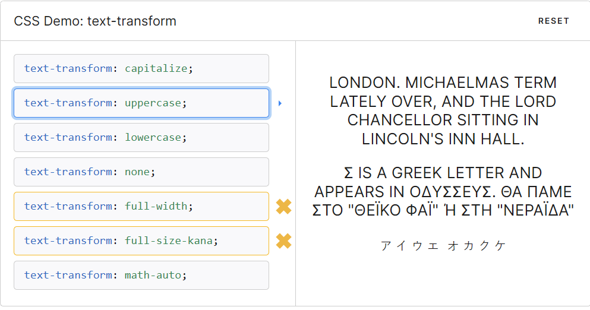

As a UX engineer, I sought out opportunities to amplify and simplify the work of our partners in design, localization, and content through updating processes, documentation, or tooling. I wrote new components frequently, but sometimes the solution wasn’t just about code.

## Locale-aware uppercasing
While using `text-transform: uppercase` was common across our codebase, in languages like Greek, this capitalizes them incorrectly! I extended our typography component to include locale-aware uppercasing with FormatJS, which would allow us to overwrite or modify all instances of it in the future if needed. To introduce the changes, I used Sourcegraph batch changes to easily update existing implementations, and then set a monitor so that we could direct people to the best practice if they introduced new instances of the anti-pattern. Now, it just works. The best practice is there by default and engineers never have to worry about this again.

## Copy guidelines
In speaking with our content lead, she surfaced that we often introduced capitalization errors in our strings. With her input on prioritization, I developed a linter that checked for uncapitalized brand words and sentence casing. Individual repos could expand the wordbank as needed for specialized projects. This change saved our content person from constantly reviewing new strings.

As part of implementation, I standardized and centralized our lint configs. We’ll be able to migrate to strict typing in the future and developers who switch teams have one less discrepancy between repos to manage.

## Defining data visualization standards
I worked with designers to understand their concerns and priorities around data visualization. By referencing research papers and best practices, I provided a short 1-pager on guidelines and guardrails for accessibility. This allowed us to have a defined standard in an overwhelming flood of knowledge so that we could move forward on styling and palettes.
